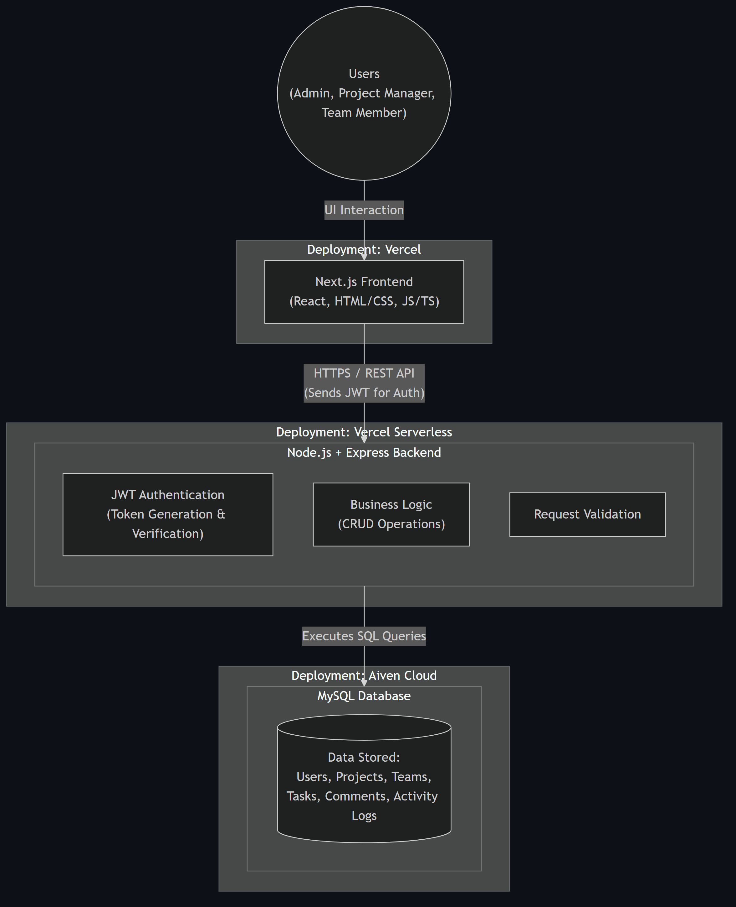
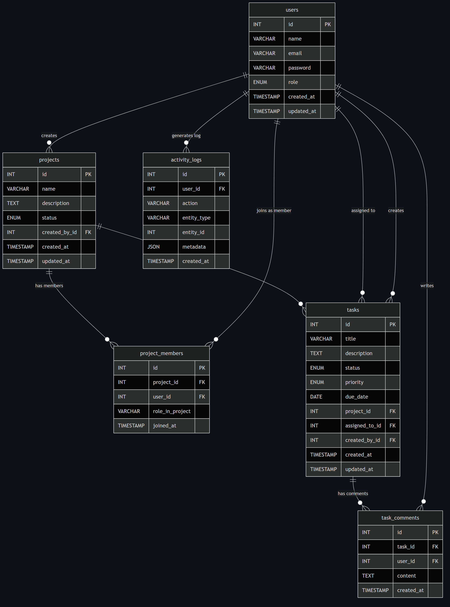

# Project & Team Task Management Platform - System Documentation

This document serves as a centralized hub for the primary technical documentation of the platform, outlining how the system is architected, how the database is structured, and how the API is consumed.

---

## 1. System Architecture

The following diagram illustrates the high-level architecture of the application, demonstrating the flow of data between the End User, the Next.js Frontend (deployed on Vercel), the Node.js/Express Backend (Serverless), and the MySQL Database (hosted on Aiven).

---

## 2. Entity Relationship Diagram (ERD)

The database schema is strictly relational. The ERD below maps out the tables (Users, Projects, Project_Members, Tasks, Comments, Activity_Logs) and their foreign-key constraints, which enforce data integrity via cascading updates/deletes.

---

## 3. API Documentation

Our REST API is robustly documented, detailing every available endpoint, required request bodies, HTTP methods, and strict Role-Based Access Control (RBAC) requirements (`ADMIN`, `PROJECT_MANAGER`, `TEAM_MEMBER`).

The full API specification is available here:
- **[View API Documentation (PDF)](./api_documentation.pdf)**
