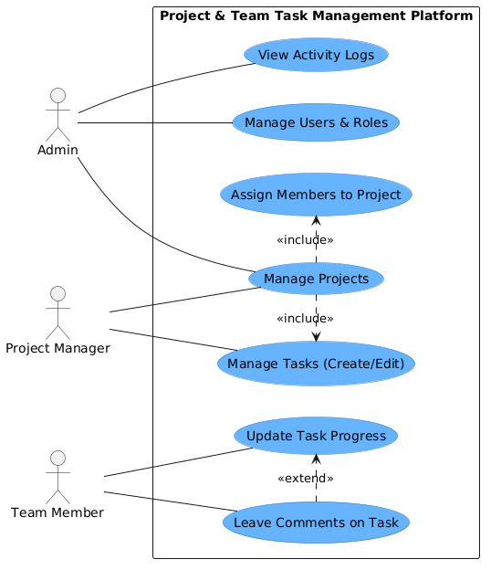

# Use Case Diagram

This diagram visualizes the primary actors in the Project & Team Task Management Platform and their interactions with the system. It strictly follows standard UML conventions, explicitly mapping `<<include>>` and `<<extend>>` relationships to show exactly how use cases connect to one another.

